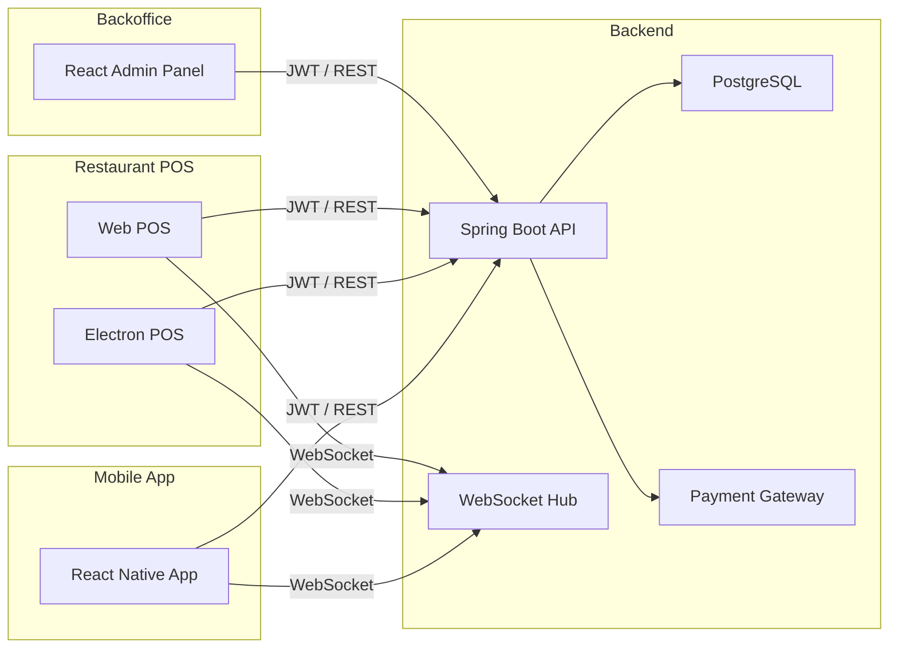

# 🍽️ Ovvium — Full-Stack Mobile Ordering & Payments Platform for Restaurants  
### *React Native · Java/Spring Boot · Electron POS · NFC/QR Table System · Startup Execution*

> **Note:** This repository documents Ovvium, a real startup I founded and built end-to-end.  
> The company no longer operates, but the project represents a complete product vision,  
> technical architecture, and execution across mobile, web, POS, backend, and business.

---

# 🚀 Overview

**Ovvium** was a full-stack restaurant technology platform designed to enable diners to  
order, split bills, and pay directly from their smartphones — all fully integrated with  
the restaurant’s POS and operations.

The vision:  
A frictionless experience where a customer sits at a table, scans an NFC/QR tag attached  
to the device on the table, joins their group, and immediately interacts with the live order.

I founded the project, designed the business model, built most of the product, and led a  
team of four across engineering and commercial development.

Although Ovvium ultimately closed during the COVID crisis, the project represents a  
**complete end-to-end startup execution** across product, technology, design, and operations.

---

# 🧠 Business Concept

### 🔹 How Ovvium worked
- Each restaurant table had a custom physical device with:
  - **NFC tag**
  - **QR code**
- Diners scanned the tag with the mobile app to **join the table session**.
- Every diner had **their own individual account** inside the shared table.
- The menu was loaded live from the restaurant’s catalog.
- Diners could:
  - Browse products  
  - Send orders to the restaurant  
  - See other guests’ orders  
  - Split bills individually or collectively  
  - Pay directly via integrated payment gateway  

### 🔹 Restaurant Side
- A dedicated **Electron POS** that connected to ticket printers, cash drawers, and hardware.
- A **kitchen view** and **bar view** for marching orders.
- A **web commander** (web POS) for staff using tablets/PDAs.
- A **backoffice** to manage:
  - Menu & products  
  - Categories  
  - Restaurant configuration  
  - Billing & invoices  

### 🔹 Monetization
- SaaS fee per restaurant installation  
- Additional revenue from **tips**, which were suggested during checkout  
  and shared between restaurant and platform.

---

# 💥 Why It Failed (and What I Learned)

We launched at the worst possible moment:  
**start of COVID**, when restaurants were collapsing and unwilling to adopt new tools,  
even though the product perfectly matched the contactless environment.

We were unable to close any commercial deals.  
Despite this, I consider Ovvium one of the most valuable learning experiences of my life.

I learned to:
- Pitch a product  
- Lead a multidisciplinary team  
- Build a brand from scratch  
- Execute under pressure  
- Architect a complex, multi-device platform  
- Integrate payments, hardware, and mobile tech  
- Assume full responsibility from end to end

I never hide failures. **Ovvium made me a far better engineer, leader, and builder.**

---

# 👤 My Role (Founder, CEO, CTO)

I acted as **everything** the company needed:

- **Founder & CEO**  
- **CTO** & lead engineer  
- **Product designer**  
- **UX/UI + brand designer** (I designed the company’s logo, branding, devices)  
- **Sales & business development**  
- **Team coordinator**  
- **Hardware concept designer** (table devices with NFC/QR)  
- **Mobile developer**  
- **Backend & API engineer**  
- **POS developer**  

I also convinced three other professionals (another engineer + two in business/commercial roles)  
to invest time and money into the project.

---

# 🛠️ Technical Architecture

Ovvium consisted of **four major systems**, all developed simultaneously:

---

## 1️⃣ Mobile App — React Native  
*(Built before React Hooks existed)*

Features:
- Table session connection (NFC or QR)  
- Live menu display  
- Create & send orders  
- Individual account per diner  
- Bill splitting  
- Integrated payments  
- Tip workflow  
- Real-time updates via WebSocket  

Tech:
- React Native  
- Redux  
- REST API + JWT auth  

Screenshots will be included under:

TODO

---

## 2️⃣ POS — Electron + React

A fully functional Point of Sale with:
- Hardware access (ticket printers, cash drawer)  
- Bar/Kitchen screens  
- Order marching  
- Multi-terminal support  
- Real-time updates  

Tech:
- Electron  
- React  
- Redux  
- Direct hardware integration  
- Restaurant session sync via WebSockets  

Screenshots:

TODO

---

## 4️⃣ Backoffice — Admin Panel

Full management panel for restaurant owners:

- Menu management  
- Product configuration  
- Restaurant setup  
- Billing & invoices  
- Operator management  
- Analytics (basic)  

Tech:
- React  
- REST APIs  
- Secured with JWT  

Screenshots:

TODO

---

## 5️⃣ Backend — Java + Spring Boot

The backend connected all systems together:

- Spring Boot  
- Spring Security (JWT)  
- JPA (Hibernate)  
- PostgreSQL  
- WebSockets for POS/mobile sync  
- Payment gateway integration  
- Fully REST-based API  

Code snippets will be included under:

---

# 🧱 High-Level Architecture Diagram

## 📈 What This Project Demonstrates

- ✔ **Ability to build complete products**, not only code  
- ✔ **Full-stack engineering** across mobile, backend, and desktop  
- ✔ **Hardware integration** with NFC and QR workflows  
- ✔ **Leadership** as founder, CTO, and product owner  
- ✔ **Execution under real-world constraints** (COVID era)  
- ✔ **Architectural thinking** and multi-system orchestration  
- ✔ **Applied entrepreneurship** and multidisciplinary coordination  

Even though Ovvium did not succeed commercially, it represents a **complete founder–engineer journey** and a solid demonstration of senior ability and ownership.

---

## 📬 Contact

If you'd like to discuss the architecture, design decisions, or startup execution aspects, feel free to reach out:

**jordi.cortes.bravo@gmail.com**  
**Spain (Remote)**

